# WordFlow

WordFlow is an Android vocabulary companion app built with Jetpack Compose. It helps you look up words, review learned vocabulary, keep notes, and practice with small word-focused tools.

## Features

- **Dictionary lookup** — search words through an online dictionary API and view definitions, phonetics, origins, and meanings.
- **Word swiping** — review words by marking them as **known** or **unknown** with swipe gestures or action buttons.
- **Words counter** — paste text and count how many words it contains.
- **Letter calculator** — analyze text and see total letters plus per-letter frequency.
- **Guess word game** — play a simple letter-guessing game with hints and restart support.
- **Viewed words** — browse words you have already encountered, filter them, and mark favorites.
- **Favorites** — keep a focused list of starred words for quick access.
- **Word notes** — add, edit, filter, and delete notes attached to words.
- **Settings** — clear viewed words, dictionary cache, notes, or all app data.

## Screens

| Home | Dictionary | Swiping |
| --- | --- | --- |
| 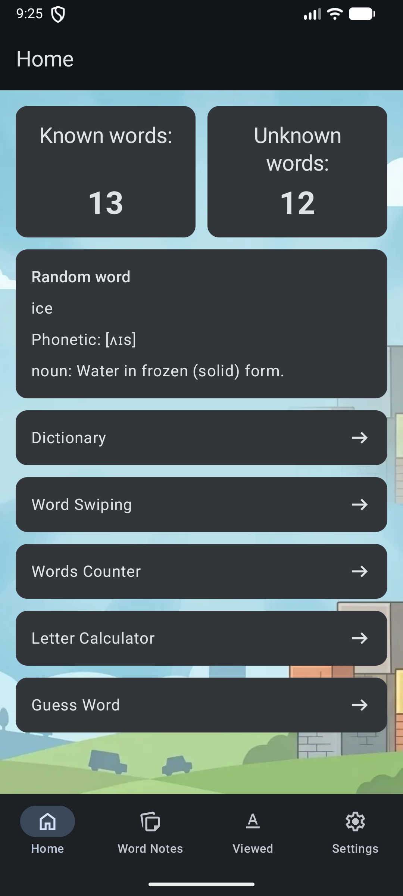 | 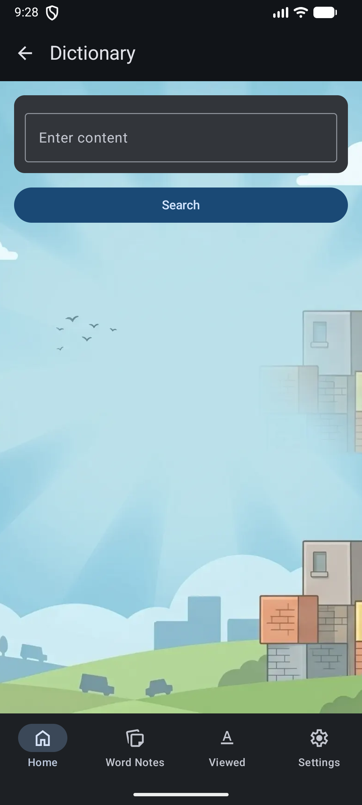 | 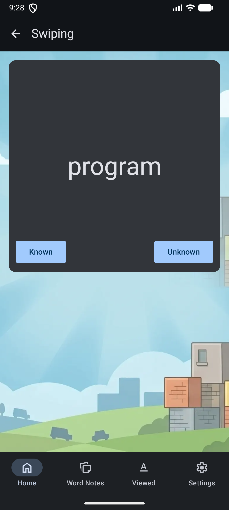 |

| Viewed | Favorites | Notes |
| --- | --- | --- |
| 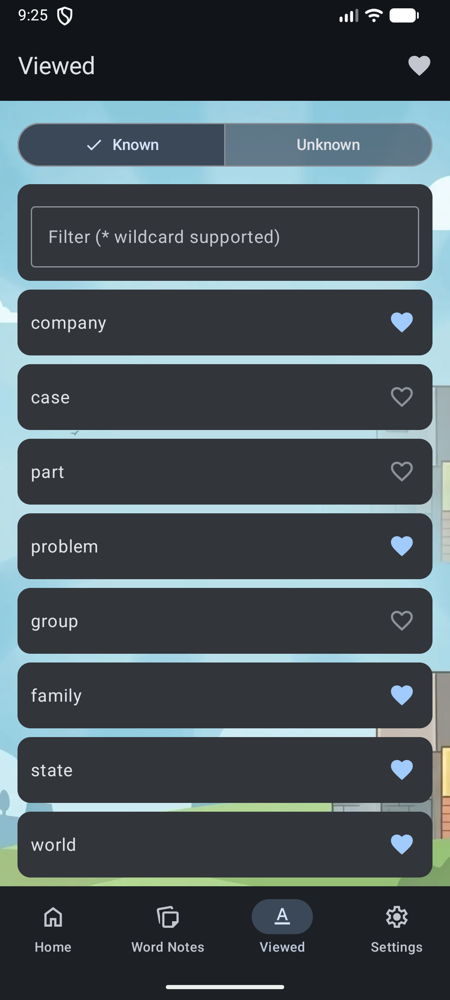 | 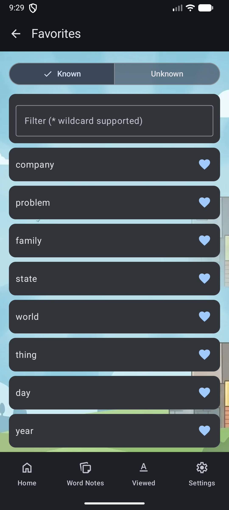 | 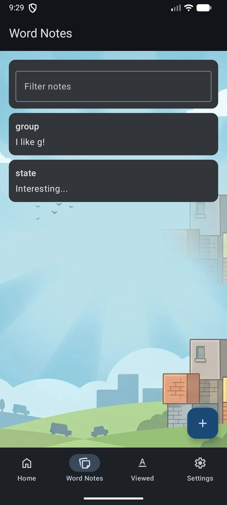 |

| Add Note | Guess Word | Word Counter |
| --- | --- | --- |
| 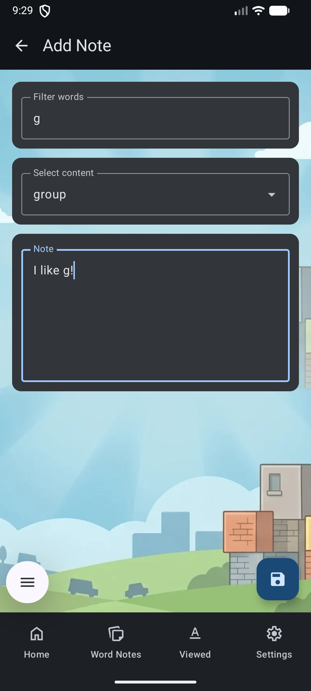 | 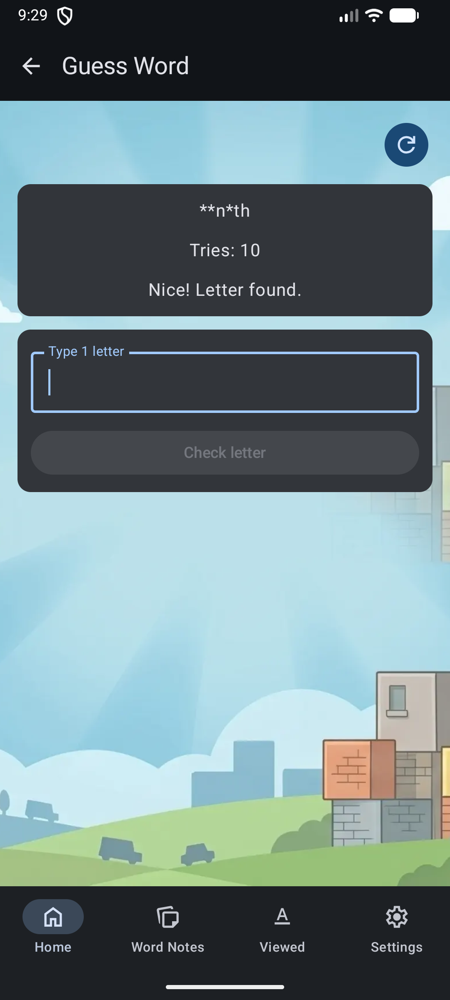 | 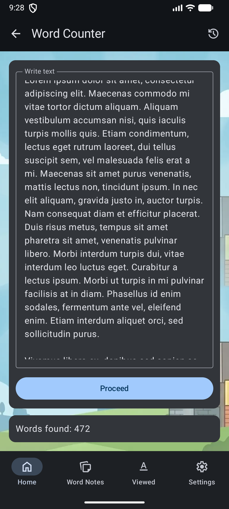 |

| Letter Calculator | Settings |
| --- | --- |
| 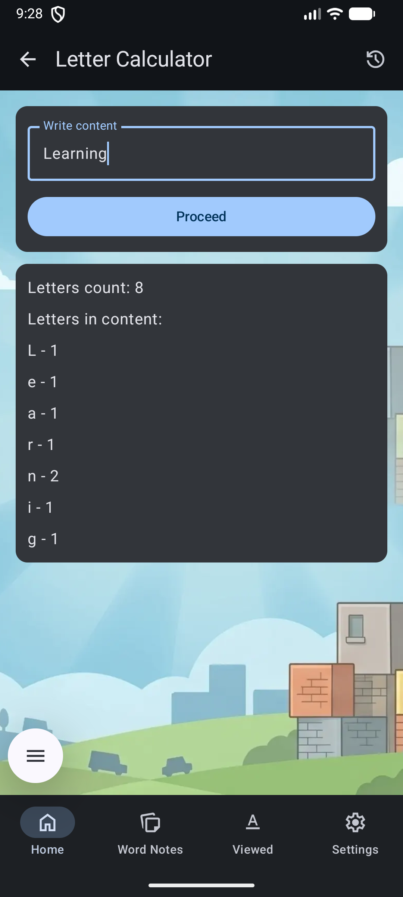 | 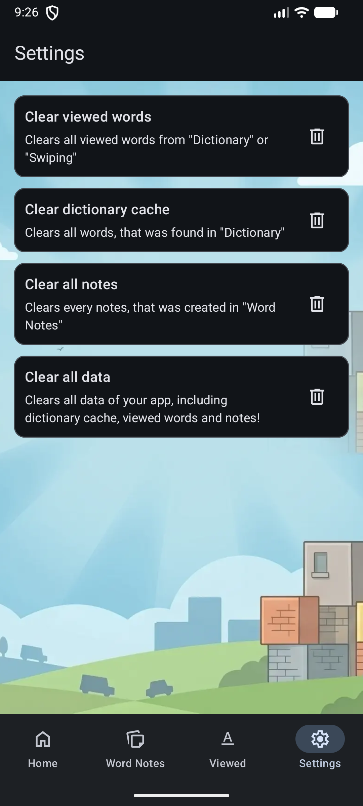 |

## Tech stack

- **Kotlin**
- **Jetpack Compose** + Material 3
- **Hilt** for dependency injection
- **Room** for local storage
- **DataStore Preferences** for app settings
- **Retrofit** + kotlinx serialization for dictionary API access
- **Navigation 3** for in-app navigation

## Project structure

- `app/src/main/java/com/word/flow/ui` — Compose UI screens and navigation
- `app/src/main/java/com/word/flow/domain` — models, repositories, and use cases
- `app/src/main/java/com/word/flow/data` — local database, datastore, API, and repository implementations
- `app/src/main/res` — icons, theme, strings, and XML resources

## Requirements

- Android Studio with recent Android SDK support
- JDK 11
- Android device or emulator with **minSdk 26** or higher

## Build and run

```bash
./gradlew assembleDebug
```

Then install the generated debug APK on a device or emulator.

## Notes

- The app uses the public dictionary API at `https://api.dictionaryapi.dev/`.
- The local database is named `lexicon.db`.
- First launch seeds the app with word data automatically.

## License

No license file is included in this repository.

